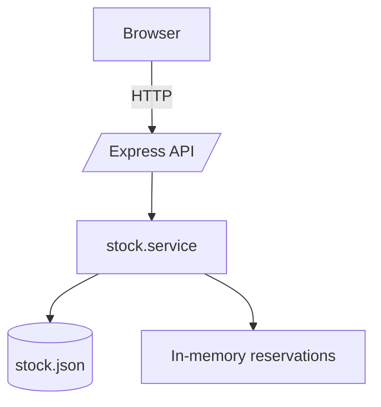

# Tuperfumeria.store

Stock management has been refactored around a single `stock.service` used by the API and frontend.

## Architecture


## Usage
1. Install dependencies: `npm install` *(may require internet access)*
2. Start backend server: `npm run server`
3. Start frontend dev server: `npm run dev`
4. Run both concurrently: `npm run fullstack`

Environment variables (`.env`):
```
MODE=backend
PORT=3000
RESERVATION_TTL_MIN=15
```

## API
- `GET /api/health`
- `GET /api/stock`
- `GET /api/stock/:sku`
- `POST /api/stock/reserve` `{ sku, quantity, version }`
- `POST /api/stock/release` `{ reservationId }`
- `POST /api/stock/commit` `{ items: [{ reservationId, sku, version }] }`

## Scripts
- `npm run seed` – write sample stock data
- `npm run migrate` – migrate legacy `data/stock.legacy.json`
- `npm test` – run unit tests

## Static mode
Set `MODE=static` to run without a backend database. Stock is read-only and reservations are emulated on the client.

## Admin
A minimal admin page can be added that uses the same API to edit products or bulk import/export via CSV.

## Known limitations in static mode
- No true reservations or concurrent safety.
